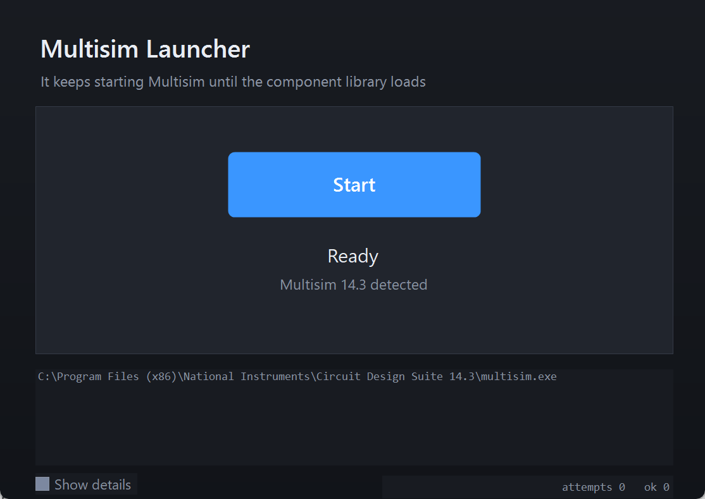

# Multisim Launcher

**Keep starting Multisim until the component library actually loads.**

A small Windows desktop launcher for NI Multisim 14.x that works around a
well known startup problem on Windows 11, where Multisim intermittently comes
up with

```
Problem accessing the database.
The Master Database cannot be accessed. Features using the Master Database
will not be available.
```

and an empty component library, so no parts can be placed.

Press **Start** and the launcher keeps launching Multisim, discarding the
attempts that came up broken, until one instance is healthy. The button then
turns into **Stop**; press it to close Multisim again.

There is **no console window**, and failed attempts are **not thrown in your
face** — only one status line changes.

> 中文说明见下方 [中文](#中文说明)。

---

## Why this is needed

This is a real, reproducible, and widely reported defect — not a corrupted
installation.

* On the reference machine, **only ~25–50 % of cold starts succeed**.
* The failures come in **runs**: several failures in a row, then several
  successes (observed: 6 consecutive failures).
* A failing attempt is **not** a crash: the process stays alive and simply
  parks on a modal dialog.
* The component database files are **not** damaged — the master database
  matches the installer's copy byte-for-byte (SHA-256 verified).
* Microsoft Q&A carries a report with **this exact message** after
  [KB5065426](https://learn.microsoft.com/zh-cn/answers/questions/5579770/kb5065426-multisim-14-3),
  with 5 users confirming the same problem.

Because the failure is random per launch and the databases are intact, the
only reliable strategy is: **try again until it works**. That is exactly what
this launcher automates.

See [`docs/BACKGROUND.md`](docs/BACKGROUND.md) for the full investigation,
including everything that was measured and ruled out.

---

## Download

Grab `MultisimLauncher-Setup.exe` from
[Releases](../../releases) and run it. It installs per-user, so **no
administrator rights are required**, and it creates a desktop shortcut.

If you prefer a portable copy, just download `MultisimLauncher.exe` — it is a
single self-contained file with no dependencies.



> **Unsigned binary warning.** Windows SmartScreen will block the installer on
> first run because it is not code-signed. Click `More info` → `Run anyway`, or
> verify the SHA-256 against `release/SHA256SUMS.txt`, or build from source.
> This is normal for any unsigned program downloaded from the internet — see
> [docs/RELEASE_NOTES.md](docs/RELEASE_NOTES.md).

## Requirements

| | |
|---|---|
| OS | Windows 10 or 11 (x64) |
| Multisim | NI Multisim / Circuit Design Suite 14.x, already installed |
| Runtime | .NET Framework 4.x — already present on every supported Windows |

The launcher **cannot install Multisim**; it only starts the copy you already
have.

---

## Is it only the Chinese version of Multisim?

Short answer: **no, but the reported cases cluster heavily in Chinese-language
environments, and that is a reporting artefact rather than a language
restriction.**

What the evidence actually shows:

* The failing code path is **locale-independent by construction**: Multisim
  opens its `.prd`/`.prj`/`.usr` databases through **DAO 3.6 → the 32-bit Jet
  4.0 / Jet 3.x ISAM engines**, none of which care about the UI language of
  Multisim.
* What *is* locale-dependent is the **system ANSI code page**. The reference
  machine runs a Chinese Windows (ACP = **936**). The most credible community
  root-cause write-up points at the **serviced 32-bit Jet ISAM driver
  (`msrd3x40.dll`)** being changed by the August–September 2025 cumulative
  updates — and on the reference machine that DLL is dated exactly with a
  cumulative update.
* Community fixes that are described as working are **registry / code page**
  changes, and one of them sets `CodePage = 65001`. That only makes sense if
  the code page is part of the mechanism.

So the honest position is:

| Claim | Status |
|---|---|
| Only the Chinese *localised build* of Multisim is affected | **Not supported** — the failing layer is not localised |
| Chinese-language Windows is over-represented in reports | **Supported** — nearly all public reports are `zh-CN` |
| The mechanism is probably code-page / Jet-ISAM related | **Plausible, partly tested** |
| Setting the console code page to 65001 fixes it | **Tested here and refuted** — 25 % vs 38 % success, within noise |

This launcher deliberately does **not** depend on any of those theories. It
works regardless of which locale gets hit, because it does not care *why* an
attempt failed.

---

## How it decides that a launch worked

A launch counts as healthy only when **all** of these hold:

1. the Jet lock files appear in the database folder
   (`MSCOMP_S.ldb`, `CPCOMP_S.ldb`) — the component databases really opened;
2. the Multisim main window exists and is visible;
3. no "Problem accessing the database" dialog is on screen;
4. the process is still alive after a short settle period.

Checking only one of these is not enough: the main window appears even on a
failed launch, and the lock files alone do not prove the UI came up.

## How a failed attempt is discarded

The broken instance is closed with a graceful `WM_CLOSE`, and only force-killed
if it refuses — it usually refuses, because it is sitting on a modal dialog.
The lock files are then removed and the next attempt is started. None of this
is shown to you beyond the attempt counter.

## How Multisim is located

1. **Registry** — the NI installer records the real database paths, so this
   works no matter which drive Multisim is installed on.
2. **Filesystem scan** — covers the default install and the common case of
   Multisim installed onto `D:` or `E:`.

Adding another location is a one-line change in
`src/MultisimLauncher/MultisimLocator.cs`.

---

## Silent start: the window only appears once it works

This is the point of the launcher, and it is on by default.

A Multisim that is going to fail still shows its splash, then its main window,
and only *then* the "cannot access the database" box. Starting it normally
therefore puts every failed attempt on screen, and you watch each one go by
before the launcher throws it away.

Instead each attempt is made entirely off screen:

1. the process is started and its windows are hidden as soon as they appear, by
   a background thread that repeats every 12 ms;
2. the databases are then checked the usual way - lock files present, main frame
   built, no error box;
3. **only a confirmed-healthy instance is revealed and brought to the front.**
   A failed attempt is closed without ever having been visible.

So the Multisim window that finally appears is always the one that works, and it
appears as though the launch had simply taken a moment. A **Silent start** toggle
in the sidebar turns this off, if you would rather watch the raw behaviour.

### What measuring it turned up

This is a claim about visibility, so it was verified by sampling rather than by
reasoning. `--diag-attempt` records, every 50 ms, which windows are visible and
whether the databases are open. Four separate faults came out of that:

* **A failed attempt is now genuinely invisible: 0 visible samples out of 727.**
* `ShowWindowAsync` has no effect on another process's window - the frame stayed
  visible for the whole attempt. Only the synchronous `ShowWindow` hides it.
* the splash screen is itself a dialog (`#32770`, title `Multisim`) - the same
  class *and* the same title as the database error box. Telling them apart needs
  the message text. Once that was known, both are simply hidden.
* the health test required the main window to be **visible**, which can never be
  true while the launcher is deliberately hiding it. Every attempt therefore ran
  to its timeout and was discarded with the databases open for nothing:
  `locks=3` for 60 seconds while `healthy=false`. The hidden path now checks that
  the frame *exists* and leaves visibility to the launcher.

One instructive near-miss: `STARTF_USESHOWWINDOW` with `SW_HIDE` looks like the
tidy way to suppress the splash, and it does suppress it - but Multisim then
never opens its databases at all. No lock files appeared for 50+ seconds, while
starting it the ordinary way produced both within 8 seconds. That flag is
deliberately not used.

---

## Building from source

No SDK, no NuGet, no Visual Studio. The build uses the **C# compiler that
ships inside Windows**.

```powershell
# launcher only  ->  dist\MultisimLauncher.exe
powershell -ExecutionPolicy Bypass -File build.ps1

# launcher + installer  ->  dist\MultisimLauncher-Setup.exe
powershell -ExecutionPolicy Bypass -File build.ps1 -MakeInstaller
```

Producing the installer additionally needs [Inno Setup](https://jrsoftware.org/isdl.php);
`installer/get-innosetup.ps1` can fetch and install it for you. End users never
need Inno Setup.

### Project layout

```
build.ps1                     build with the in-box csc.exe
src/MultisimLauncher/
    Program.cs                entry point, Win32 interop
    MultisimLocator.cs        install detection, database folders, health checks
    MainForm.cs               the GUI (dark, hand painted)
    app.manifest              asInvoker + per-monitor DPI + common controls v6
installer/
    MultisimLauncher.iss      Inno Setup script
    get-innosetup.ps1         fetch Inno Setup and build the installer
    payload/install.bat       fallback installer (used by the IExpress path)
docs/BACKGROUND.md            the full investigation
```

### Why `asInvoker` and not administrator?

Multisim keeps a **per-user** component database in
`%APPDATA%\National Instruments\Circuit Design Suite\<ver>\database`. Running
Multisim elevated would give it a different profile and therefore a different
user database. The launcher must run as the logged-on user.

---

## Notes on the code

* **C# 5 only.** The in-box compiler is C# 5, so no string interpolation, no
  null-conditional operators, no expression-bodied members.
* **`SendMessageTimeoutW`, never `SendMessageW`.** A synchronous `SendMessage`
  blocks *forever* while the target thread is not pumping messages — which is
  exactly what Multisim does while loading its ~238 MB database. This was a
  real hang in an earlier tool.
* **Non-ASCII strings are built from code points.** Windows PowerShell 5.1
  decodes BOM-less UTF-8 files as ANSI, which silently corrupts non-ASCII
  literals; the dialog-text match uses `new string(new char[] { (char)0x8BBF, ... })`
  so the source stays pure ASCII and cannot break.
* **All framework references are in-box** (`System`, `System.Core`,
  `System.Drawing`, `System.Windows.Forms`) so the build needs nothing extra.

---

## Contributing

Issues and pull requests are welcome, particularly:

* install locations that the locator fails to find (please include the path);
* reports from **non-Chinese** Windows, to settle the locale question;
* confirmation on Multisim versions other than 14.3.

When reporting a problem, please attach
`%LOCALAPPDATA%\MultisimLauncher\launcher.log`.

## Disclaimer

Not affiliated with, endorsed by, or sponsored by National Instruments or
Emerson. "Multisim", "Ultiboard" and "NI Circuit Design Suite" are trademarks
of their respective owners.

This program does **not** modify, patch, or crack Multisim. It does not touch
your databases, and it changes no Windows settings. It only starts and closes
programs already on your computer.

## License

[MIT](LICENSE.txt)

---

# 中文说明

**反复启动 Multisim,直到元器件库真正加载成功。**

Windows 11 上 Multisim 14.x 启动时会**随机**出现

```
访问数据库时发生错误。
主数据库 无法访问。使用 主数据库 的功能将不可用。
```

然后元器件库是空的,什么都放不了。

这个启动器点一下就帮你反复尝试,把没能正常加载的那几次**安静地关掉**,
直到有一次真正可用为止。**没有终端窗口**,失败过程不会弹一堆框给你看,
只有一行状态文字在变。成功之后按钮变成「停止」,再点一下就把 Multisim 关掉。

## 它解决的是什么

这是一个**真实、可复现、且被广泛报告**的缺陷,不是你的安装坏了:

* 参考机器上**冷启动成功率只有约 25%–50%**;
* 失败是**成串出现**的:连着失败好几次,然后连着成功几次(实测出现过连续 6 次失败);
* 失败**不是崩溃**:进程还活着,只是永久卡在一个模态对话框上;
* 元器件库文件**没有损坏**——主库与安装包内的原始文件 SHA-256 完全一致;
* Microsoft Q&A 上有 [KB5065426 之后出现**逐字相同**报错](https://learn.microsoft.com/zh-cn/answers/questions/5579770/kb5065426-multisim-14-3)的报告,5 人确认同样问题。

既然失败是随机的、而数据库是好的,唯一可靠的办法就是:**不行就再来一次**。
这个启动器就是把这个过程自动化。

## 是不是只有中文版才有这个问题?

**不是。** 但公开报告里中文环境占绝大多数,这更像是**报告来源的偏差**,不是语言限制。

* 出错的那一层**与界面语言无关**:Multisim 通过 **DAO 3.6 → 32 位 Jet 4.0 / Jet 3.x 引擎**打开数据库;
* 真正与区域相关的是**系统 ANSI 代码页**(参考机器是中文 Windows,ACP = **936**);
* 社区里最可信的一条根因分析指向 **2025 年 8–9 月累积更新改动了 32 位 Jet ISAM 驱动
  (`msrd3x40.dll`)**——参考机器上这个 DLL 的日期正好对应一次累积更新;
* 社区给出的"有效"解法都是**注册表/代码页**层面的改动,其中一个就是把 `CodePage` 改成 `65001`。
  这只有在代码页确实是机制的一部分时才说得通。

> 社区流传的「把控制台 `CodePage` 改成 65001」这一条,我在参考机器上做了 8×2 交叉实测:
> **25% vs 38%,差异在噪声范围内,证伪。**

所以本启动器**刻意不依赖任何上述理论**——不管你的机器是哪种区域设置被命中,它都能用,
因为它不关心你**为什么**失败。

## 它怎么判断"这次成功了"

必须**同时**满足:

1. 数据库目录里出现 Jet 锁文件(`MSCOMP_S.ldb`、`CPCOMP_S.ldb`)——说明库真的打开了;
2. Multisim 主窗口存在且可见;
3. 屏幕上没有"访问数据库时发生错误"对话框;
4. 进程在随后一小段观察期内仍然存活。

只看其中一条是不够的:失败的那次**主窗口也会出现**,而只看锁文件也不能证明界面起来了。

## 关于 Multisim 的安装位置

1. **注册表优先**——NI 安装程序记录了真实的数据库路径,所以**无论装在哪个盘**都能找到;
2. **文件系统扫描兜底**——覆盖默认的 C 盘安装,以及很常见的**装在 D 盘 / E 盘**的情况。

如果你的路径很特殊,欢迎提 issue 把路径发我,加一条匹配规则只是一行代码。

## 静默启动:确认可用之后,窗口才出现

这是这个启动器的核心,**默认开启**。

注定失败的那次 Multisim,也会先显示启动画面,再显示主窗口,**然后**才弹出
"访问数据库时发生错误"。所以按常规方式启动,就意味着**每一次失败都摆在屏幕上**,
你得看着它一次次出现,再被启动器丢弃。

现在的做法是**每次尝试全程在屏幕外完成**:

1. 启动进程后,**一出现窗口就立刻隐藏**,由一个后台线程每 12ms 重复执行;
2. 然后按原有方式判定健康:锁文件存在、主框架已建立、没有报错框;
3. **只有确认健康的那一次,才把窗口亮出来并切到前台**;失败的那次在全然不可见的情况下被关掉。

所以你最终看到的 Multisim 窗口,**永远是能用的那一个**,而且出现得很自然,
就像启动只是稍微花了一点时间。侧栏有一个 **静默启动** 开关,可以关掉它去看原始行为。

### 实测暴露出的问题

这是一个关于"可见性"的断言,所以我用**采样**去验证,而不是靠推理。
`--diag-attempt` 每 50ms 记录一次:哪些窗口可见、数据库是否打开。它揪出了**四个独立的错误**:

* **失败的那次现在是真的不可见:727 次采样,0 次看到窗口**;
* `ShowWindowAsync` 对**别的进程的窗口无效**——框架在整个尝试期间一直可见,只有同步的
  `ShowWindow` 才藏得住;
* **启动画面本身就是一个对话框**(`#32770`,标题 `Multisim`),和报错框**类名和标题完全相同**,
  只能靠消息内容区分。搞清楚这点之后,两者一并隐藏即可;
* 健康判定原本要求主窗口**可见**——而启动器正故意把它藏起来,**这个条件永远不可能成立**。
  结果每次尝试都跑满超时被丢弃,数据库白打开一场:`locks=3` 持续 60 秒,`healthy=false`。
  隐藏路径现在检查框架**是否存在**,可见性交给启动器自己管。

还有一个值得记录的弯路:`STARTF_USESHOWWINDOW` 配 `SW_HIDE` 看起来是压制启动画面最优雅的办法,
而且确实压住了——但 **Multisim 从此完全不打开数据库**:50 多秒没有任何锁文件,
而常规方式 8 秒内就出现了两个。所以这个标志**刻意不用**。

## 从源码构建

不需要 SDK、不需要 NuGet、不需要 Visual Studio——用的是 **Windows 自带的 C# 编译器**。

```powershell
# 只构建启动器      -> dist\MultisimLauncher.exe
powershell -ExecutionPolicy Bypass -File build.ps1

# 启动器 + 安装包   -> dist\MultisimLauncher-Setup.exe
powershell -ExecutionPolicy Bypass -File build.ps1 -MakeInstaller
```

### 诊断开关

发布版自带一个可复现"隐藏是否真的生效"的开关:

```powershell
# 跑一次静默尝试, 记录全程哪些窗口可见
.\dist\MultisimLauncher.exe --diag-attempt 1

# 强制走失败路径 (把健康检查指向一个不存在的目录, 不碰真实安装)
.\dist\MultisimLauncher.exe --diag-attempt 1 --force-fail

# 对照组: 关掉隐藏循环
.\dist\MultisimLauncher.exe --diag-attempt 1 --no-hide-loop
```

报告写到 `%TEMP%\multisimlauncher-diag.txt`,最后一行给出
`samples` / `samplesWithVisibleWindow` / `peak` / `hideTicks` / `hideActions`。

**这些开关刻意留在发布版里**:只有几十行,不调用就什么都不做,
而"能在一台真的出问题的机器上量出窗口到底可不可见"比省这点体积重要得多。

生成安装包额外需要 [Inno Setup](https://jrsoftware.org/isdl.php),
`installer/get-innosetup.ps1` 可以自动帮你下载安装。**终端用户完全不需要它。**

## 许可证

[MIT](LICENSE.txt)
